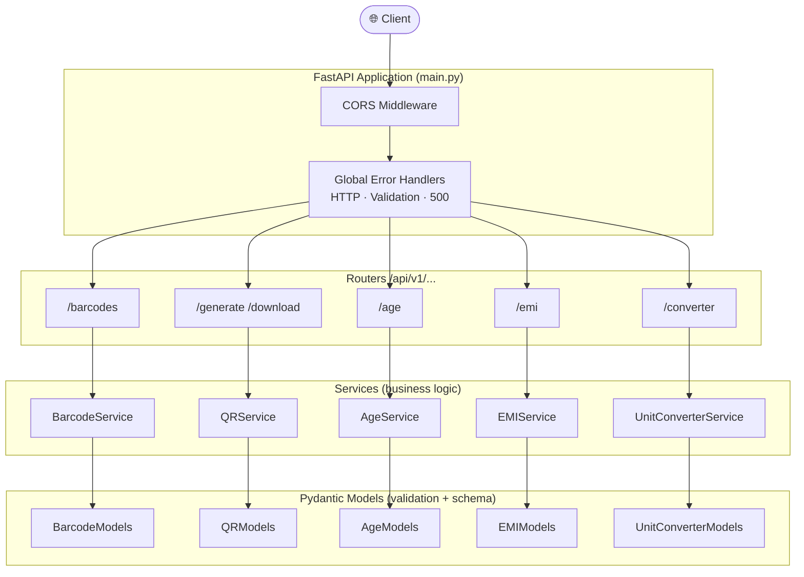
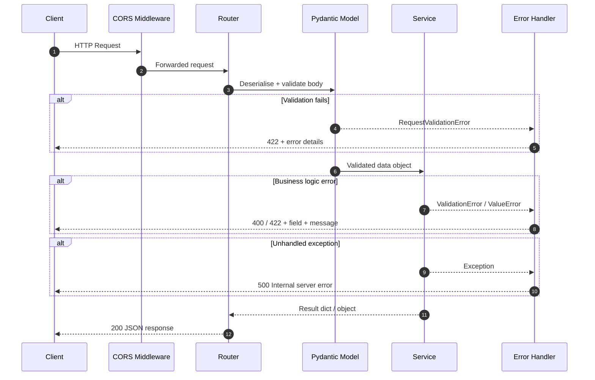
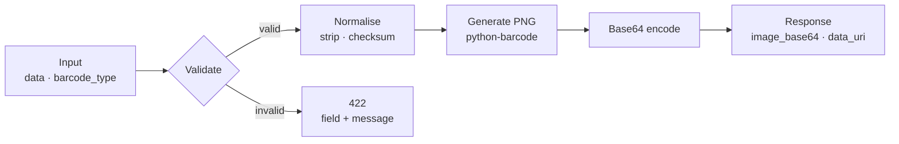
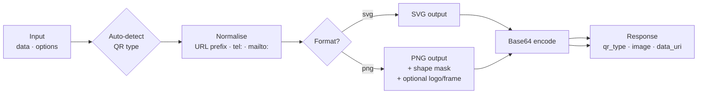
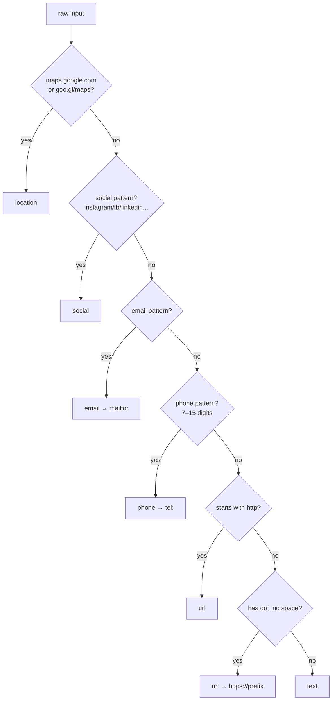
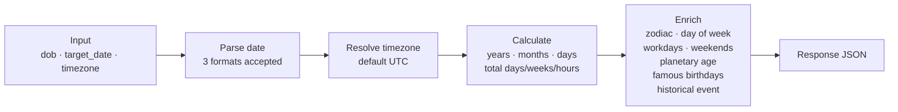
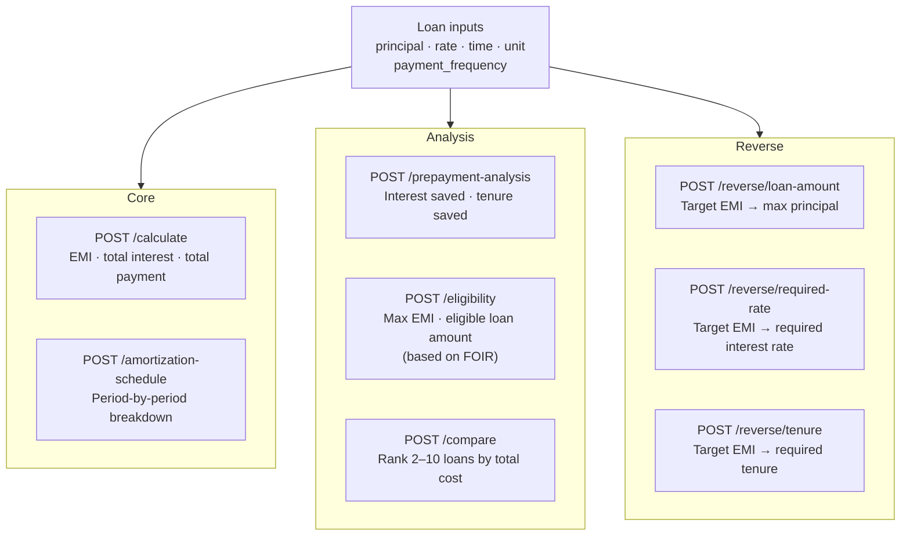
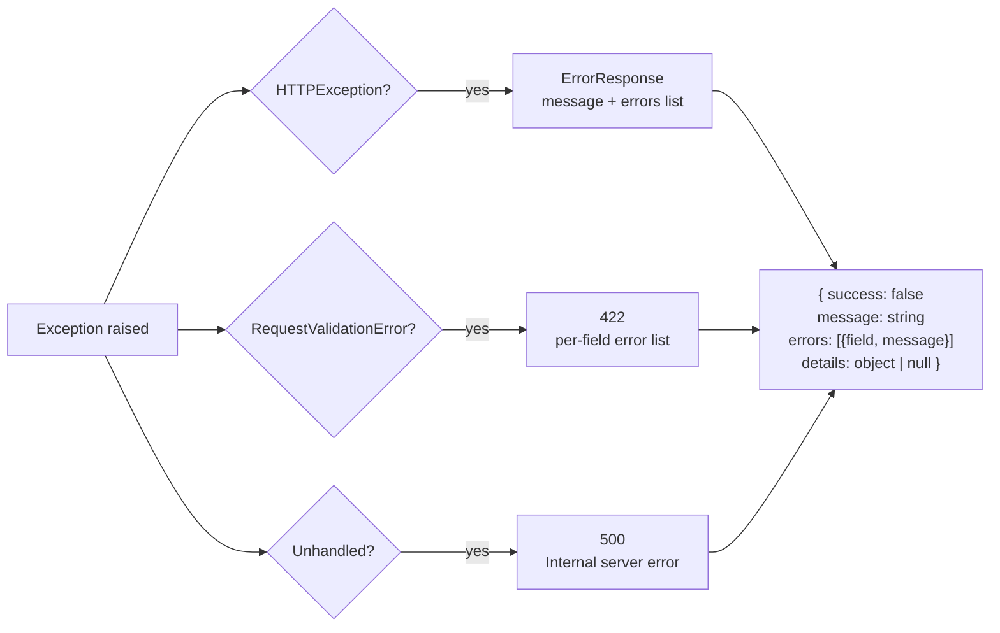
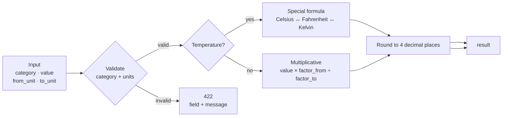

# Daily Utility Tools — Backend

A **FastAPI** backend providing REST APIs for everyday utility features: barcode generation, QR code generation, age calculation, EMI/loan calculations, and unit conversion.

---

## Table of Contents

- [Architecture Overview](#architecture-overview)
- [Request Lifecycle](#request-lifecycle)
- [Project Structure](#project-structure)
- [Module Map](#module-map)
- [API Reference](#api-reference)
  - [Barcode Generator](#barcode-generator)
  - [QR Code Generator](#qr-code-generator)
  - [Age Calculator](#age-calculator)
  - [EMI Calculator](#emi-calculator)
  - [Unit Converter](#unit-converter)
- [Error Handling](#error-handling)
- [Getting Started](#getting-started)

---

## Architecture Overview

How the project is layered — every request moves through these four tiers in order.



---

## Request Lifecycle

What happens from the moment a request arrives to the moment a response leaves.



---

## Project Structure

```
Daily_Utility_Tools_Backend_/
├── main.py                       ← App entry, middleware, error handlers
├── requirements.txt
├── .env                          ← Secrets (not committed)
├── alembic.ini
├── alembic/
│   └── env.py                    ← DB migration config
├── models/
│   ├── age_model.py
│   ├── barcode_models.py         ← Also holds ErrorItem + ErrorResponse
│   ├── emi_models.py
│   ├── qr_model.py
│   └── unit_converter_models.py
├── routes/
│   ├── age_route.py              ← GET + POST /api/v1/age/calculate
│   ├── barcode_routes.py         ← POST /api/v1/barcodes/generate|download
│   ├── emi_routes.py             ← 8 endpoints under /api/v1/emi
│   ├── qr_routes.py              ← GET + POST /generate|download
│   └── unit_converter_routes.py  ← GET /categories · GET /units · GET+POST /convert
└── services/
    ├── age_service.py
    ├── barcode_service.py
    ├── emi_service.py
    ├── qr_service.py
    └── unit_converter_service.py
```

---

## Module Map

All five modules, their endpoints, inputs, and outputs at a glance.

### 🔲 Barcode Generator — `/api/v1/barcodes`

| Method | Endpoint | Input | Output |
|---|---|---|---|
| POST | `/generate` | `data`, `barcode_type` | JSON with `image_base64` + `data_uri` |
| POST | `/download` | `data`, `barcode_type` | PNG file download |

**Types:** `code128` · `code39` · `code93` · `ean8` · `ean13` · `upc` · `isbn10` · `isbn13` · `issn` · `gs1_128` · `ean`

---

### 📱 QR Code Generator — `/`

| Method | Endpoint | Input | Output |
|---|---|---|---|
| POST | `/generate` | `data`, `qr_type`, `size`, `fill_color`, `back_color`, `error_correction`, `shape`, `frame`, `output_format` | JSON with `image` + `data_uri` |
| GET | `/generate` | `data`, `qr_type` (query params) | JSON with `image` + `data_uri` |
| POST | `/download` | same as generate | PNG file download |

**Auto-detected types:** `url` · `email` · `phone` · `wifi` · `location` · `vcard` · `whatsapp` · `social` · `text`

---

### 🎂 Age Calculator — `/api/v1/age`

| Method | Endpoint | Input | Output |
|---|---|---|---|
| POST | `/calculate` | `dob`, `target_date`, `timezone` | Full age breakdown (see below) |
| GET | `/calculate` | same as query params | Full age breakdown |

**Output fields:** `years` · `months` · `days` · `total_days` · `total_weeks` · `total_hours` · `next_birthday_days` · `day_of_birth` · `zodiac_sign` · `working_days` · `weekends` · `life_progress` · `planetary_age` · `famous_birthdays` · `historical_event`

---

### 💰 EMI Calculator — `/api/v1/emi`

| Method | Endpoint | Input | Output |
|---|---|---|---|
| POST | `/calculate` | `principal`, `rate`, `time`, `unit`, `payment_frequency` | `emi`, `total_interest`, `total_payment` |
| POST | `/amortization-schedule` | same + `summary_by_year` | Period-by-period payment breakdown |
| POST | `/prepayment-analysis` | same + `prepayments[]` | Interest saved, tenure saved per prepayment |
| POST | `/eligibility` | `monthly_income`, `existing_emi`, `foir_limit`, `rate`, `time` | `max_affordable_emi`, `eligible_loan_amount` |
| POST | `/compare` | `loans[]` (2–10 items) | Ranked by total cost with cost difference |
| POST | `/reverse/loan-amount` | `target_emi`, `rate`, `time` | Max principal for that EMI |
| POST | `/reverse/required-rate` | `principal`, `target_emi`, `time` | Interest rate needed |
| POST | `/reverse/tenure` | `principal`, `rate`, `target_emi` | Tenure needed |

**Payment frequencies:** `monthly` · `quarterly` · `semi_annual` · `annual`

---

### 🔁 Unit Converter — `/api/v1/converter`

| Method | Endpoint | Input | Output |
|---|---|---|---|
| GET | `/categories` | — | List of all 12 categories |
| GET | `/units` | `category` (query param) | List of supported units for that category |
| POST | `/convert` | `category`, `value`, `from_unit`, `to_unit` | `result` (rounded to 4 decimal places) |
| GET | `/convert` | same as query params (`fromUnit`, `toUnit`) | `result` |

**Supported categories:** `length` · `weight` · `volume` · `area` · `speed` · `time` · `temperature` · `digital_storage` · `pressure` · `energy` · `power` · `angle`

---

## API Reference

### Barcode Generator



**Supported types:** `code128` · `code39` · `code93` · `ean8` · `ean13` · `upc` · `isbn10` · `isbn13` · `issn` · `gs1_128` · `ean`

| Endpoint | Method | Returns |
|---|---|---|
| `/api/v1/barcodes/generate` | POST | JSON with `image_base64` + `data_uri` |
| `/api/v1/barcodes/download` | POST | PNG file (`barcode.png`) |

**Request body**
```json
{ "data": "5901234123457", "barcode_type": "ean13" }
```

---

### QR Code Generator



**Type auto-detection logic**



| Endpoint | Method | Returns |
|---|---|---|
| `/generate` | POST / GET | JSON with `image` + `data_uri` |
| `/download` | POST | PNG file (`qr.png`) |

---

### Age Calculator



**Accepted date formats:** `YYYY-MM-DD` · `DD-MM-YYYY` · `DD/MM/YYYY`

| Endpoint | Method |
|---|---|
| `/api/v1/age/calculate` | POST + GET |

---

### EMI Calculator

Eight endpoints covering the full loan analysis lifecycle.



**Payment frequencies:** `monthly` · `quarterly` · `semi_annual` · `annual`

---

## Error Handling

All endpoints share one consistent error shape.



---

## Getting Started

### Prerequisites
- Python 3.12+

### Installation

```bash
git clone https://github.com/naiyo-24/Daily_Utility_Tools_Backend_.git
cd Daily_Utility_Tools_Backend_

python -m venv venv
source venv/bin/activate       # Windows: venv\Scripts\activate

pip install -r requirements.txt
cp .env.example .env           # edit as needed
```

### Run

```bash
uvicorn main:app --host 127.0.0.1 --port 8000 --reload
```

- Swagger UI → `http://127.0.0.1:8000/docs`
- ReDoc → `http://127.0.0.1:8000/redoc`
- Health check → `GET /health`

### Database migrations

```bash
alembic upgrade head                              # apply migrations
alembic revision --autogenerate -m "description" # new migration
alembic downgrade -1                              # rollback one
```

---

### Unit Converter



**Supported categories and units**

| Category | Units |
|---|---|
| Length | `m` `km` `cm` `mm` `dm` `nm` `um` `mile` `yard` `foot` `inch` `nautical_mile` |
| Weight | `kg` `g` `mg` `ton` `pound` `ounce` `stone` `dram` |
| Volume | `liter` `ml` `gallon` `cup` `pint` `quart` |
| Area | `sq_m` `sq_km` `sq_ft` `acre` `hectare` |
| Speed | `m/s` `km/h` `mph` `knot` |
| Time | `second` `minute` `hour` `day` `week` |
| Temperature | `Celsius` `Fahrenheit` `Kelvin` |
| Digital Storage | `bit` `byte` `KB` `MB` `GB` `TB` `PB` |
| Pressure | `pascal` `bar` `psi` `atm` |
| Energy | `joule` `kj` `calorie` `kcal` `wh` `kwh` |
| Power | `watt` `kw` `hp` |
| Angle | `degree` `radian` `gradian` |

| Endpoint | Method | Description |
|---|---|---|
| `/api/v1/converter/categories` | GET | List all supported categories |
| `/api/v1/converter/units?category=length` | GET | List units for a category |
| `/api/v1/converter/convert` | POST + GET | Perform conversion |

**Request body**
```json
{ "category": "length", "value": 100, "from_unit": "m", "to_unit": "foot" }
```

**Response**
```json
{ "result": 328.084 }
```